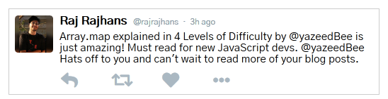

# React Component to display a Tweet

This is a basic React Component to display a tweet. It is intended as a beginner project in learning ReactJS.

Here is an example of the component displaying a tweet -

## Blog Post 

To know more about this project, please read the blog post accompanying it - [Getting up and running with ReactJS](https://rajrajhans.com/).  

## Running the project

This project was bootstrapped with [Create React App](https://github.com/facebook/create-react-app).

In the project directory, you can run:

#### `npm start`

Runs the app in the development mode. 
Open [http://localhost:3000](http://localhost:3000) to view it in the browser.

The page will reload if you make edits. 
You will also see any lint errors in the console.

#### `npm run build`

Builds the app for production to the `build` folder. 
It correctly bundles React in production mode and optimizes the build for the best performance.

The build is minified and the filenames include the hashes. 
Your app is ready to be deployed!
